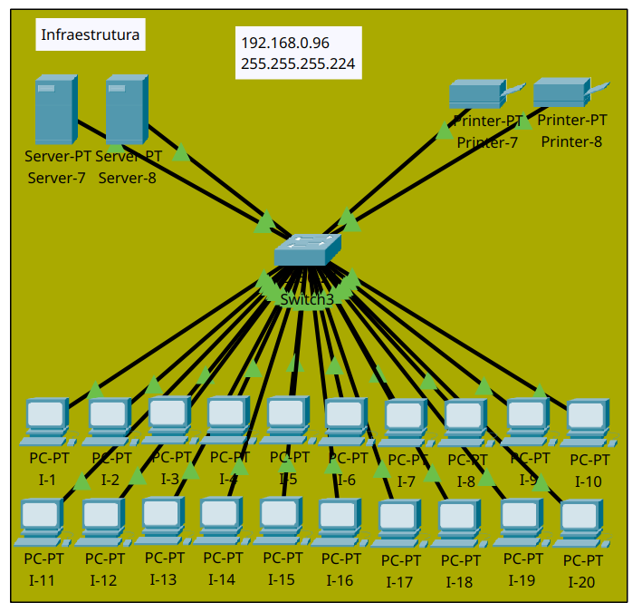

# **SuperTech-Rede-Distribuída-CiscoPT**

## **Descrição do Projeto**
Este projeto foi desenvolvido como parte da disciplina de **Redes e Sistemas Distribuídos**, no curso de **Engenharia de Software**, para demonstrar a aplicação prática de conceitos fundamentais de redes. A infraestrutura foi projetada para a empresa fictícia **Super Tech** e implementada utilizando o software **Cisco Packet Tracer**.

O foco do projeto foi criar uma rede lógica eficiente, com segmentação por VLANs, sub-redes com endereçamento IP estático e dinâmico, e a utilização de serviços como DHCP. Cada departamento da empresa possui uma configuração personalizada, respeitando as demandas específicas.

---

## **Objetivos**
- Simular uma rede empresarial distribuída para quatro departamentos distintos.
- Aplicar técnicas de segmentação lógica com VLANs para melhorar segurança e organização.
- Demonstrar a configuração de sub-redes utilizando máscaras de rede classe C.
- Implementar serviços de rede, como endereçamento IP estático e dinâmico via DHCP.
- Validar a comunicação entre dispositivos com testes de conectividade.

---

## **Planejamento da Rede**
### **Estrutura Geral**
- **Topologia**: Configuração em estrela.
- **Departamentos**:
  - Engenharia
  - Compras
  - TI Interno
  - Infraestrutura
- **Dispositivos por Departamento**:
  - 20 PCs, 2 servidores e 2 impressoras conectados a um switch central (Cisco 2950-24).

### **Endereçamento IP**
Cada departamento utiliza uma sub-rede com máscara classe C (255.255.255.224), capaz de acomodar até 30 dispositivos:
- **Engenharia**: `192.168.0.0/27`
- **Compras**: `192.168.0.32/27`
- **TI Interno**: `192.168.0.64/27`
- **Infraestrutura**: `192.168.0.96/27`

### **Segmentação por VLAN**
- **VLAN 1 (Portas 1-12)**: Contém 10 PCs, 1 servidor e 1 impressora.
- **VLAN 2 (Portas 13-24)**: Mesma configuração da VLAN 1, com novos dispositivos.

---

## **Configuração e Implementação**
### **1. Topologia**
A rede foi planejada em uma estrutura hierárquica, com switches segmentando os departamentos em VLANs para garantir isolamento lógico. A comunicação entre dispositivos foi configurada para respeitar a segmentação e o endereçamento IP.

### **2. Configuração no Cisco Packet Tracer**
- **Switches**:
  - Configuração de VLANs.
  - Atribuição de portas a VLANs específicas.
- **Endereçamento IP**:
  - IP estático para os departamentos de Engenharia e TI Interno.
  - IP dinâmico (DHCP) para os departamentos de Compras e Infraestrutura.
- **Testes de Conectividade**:
  - Comando `ping` para validar a comunicação entre dispositivos dentro e fora das VLANs.

### **3. Resultados**
- Comunicação bem-sucedida entre dispositivos de cada sub-rede.
- Atribuição correta de endereços IP dinâmicos para dispositivos via DHCP.
- Isolamento lógico entre os departamentos por meio das VLANs.

---

## **Como Utilizar**
1. Faça o download do arquivo `SupertechPortfoliio.pkt` localizado na pasta `Projeto/`.
2. Abra o arquivo no **Cisco Packet Tracer**
3. Explore a rede lógica e teste a conectividade utilizando comandos como `ping`.
4. Consulte o relatório em PDF para entender os detalhes das configurações e do planejamento.

---

## **Imagens**
### **Topologia Lógica Geral**

### **Detalhes dos Departamentos**
1. **Engenharia**  
   

2. **Compras**  
   

3. **TI Interno**  
   

4. **Infraestrutura**  
   

